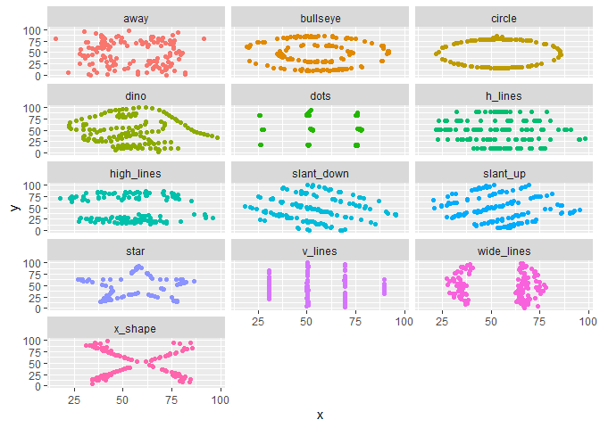

Lab 01 - Hello R
================
Ryan W
1/12/23

## Load packages and data

``` r
library(tidyverse) 
```

    ## Warning: package 'tidyverse' was built under R version 4.1.3

``` r
library(datasauRus)
```

    ## Warning: package 'datasauRus' was built under R version 4.1.3

## Exercises

### Exercise 1

Datasaurus_Dozen has:

1846 rows 3 columns 3 variables: dataset, x-values, and y-values

datasaurus_dozen %>% count(dataset) %>% print(13)

### Exercise 2

First let’s plot the data in the dino dataset:

``` r
dino_data <- datasaurus_dozen %>%
  filter(dataset == "dino")

ggplot(data = dino_data, mapping = aes(x = x, y = y)) +
  geom_point()
```

<!-- -->

And next calculate the correlation between `x` and `y` in this dataset,
even though it doesn’t make sense to do so:

``` r
dino_data %>%
  summarize(r = cor(x, y))
```

    ## # A tibble: 1 x 1
    ##         r
    ##     <dbl>
    ## 1 -0.0645

### Exercise 3

``` r
star_data <- datasaurus_dozen %>%
  filter(dataset == "star")

ggplot(data = star_data, mapping = aes(x = x, y = y)) +
  geom_point()
```

<!-- -->

``` r
star_data %>%
  summarize(r = cor(x,y))
```

    ## # A tibble: 1 x 1
    ##         r
    ##     <dbl>
    ## 1 -0.0630

The correlation for the star dataset is almost exactly the same as the
one for the dino dataset!

### Exercise 4

``` r
circle_data <- datasaurus_dozen %>%
  filter(dataset == "circle")

ggplot(data = circle_data, mapping = aes(x = x, y = y)) +
  geom_point()
```

<!-- -->

``` r
circle_data %>%
  summarize(r = cor(x,y))
```

    ## # A tibble: 1 x 1
    ##         r
    ##     <dbl>
    ## 1 -0.0683

The correlation for the circle dataset is nearly identical to the dino
and star datasets, even though the scatterplots are completely
different!

### Exercise 5

``` r
ggplot(datasaurus_dozen, aes(x = x, y = y, color = dataset)) +
  geom_point() +
  facet_wrap(~ dataset, ncol = 3) +
  theme(legend.position = "none")
```

<!-- -->

``` r
datasaurus_dozen %>%
  group_by(dataset) %>%
  summarize(r = cor(x,y)) %>%
  print(13)
```

    ## # A tibble:
    ## #   13 x 2
    ##    dataset   
    ##    <chr>     
    ##  1 away      
    ##  2 bullseye  
    ##  3 circle    
    ##  4 dino      
    ##  5 dots      
    ##  6 h_lines   
    ##  7 high_lines
    ##  8 slant_down
    ##  9 slant_up  
    ## 10 star      
    ## 11 v_lines   
    ## 12 wide_lines
    ## 13 x_shape   
    ## # ... with 1
    ## #   more
    ## #   variable:
    ## #   r <dbl>

I would resize my figures and whatever else here, but I couldn’t find
“Output Options…” in any dropdown menu :(.

## Bonus Tips by Yoo Ri

Here are some helpful tips :)

-   filter() is for extracting rows

-   group_by() is for grouping datasets by assigned column

-   ungroup() cancels the grouping

-   summarize() is often used with group_by(). This function can print
    the output according to the group_by().

-   facet_grid(y\~x,…) creates a grid with variable y as a row, variable
    x as a column  

-   facet_wrap(x,… ) is useful when there is only one variable
